### Deribit Websocket API v2

This is a python wrapper written to make it simple to connect to Deribit's JSON-RPC api v2 using websockets.

#### Table of Contents  
1. [Installation](#installation)
2. [Credentials](#credentials)
3. [Index Price](#index)
4. [Ticker Data](#ticker)
5. [Buy](#buy)
6. [Sell](#sell)
7. [Stop Buy](#stop_buy)
8. [Stop Sell](#stop_sell)
9. [Edit](#edit)
10. [Cancel](#cancel)
11. [Cancel All](#cancel_all)
12. [Account Summary](#account_summary)
13. [Get Position](#get_position)

<a name="installation"/>

#### 1. Installation Ubuntu 18.04

```shell
mkdir deribit_ws && cd deribit_ws

git clone https://github.com/Jimmy-sha256/deribit_ws.git

virtualenv --python=/usr/bin/python3.7 venv

source /venv/bin/activate

pip install -r requirements.txt

```
<a name="credentials"/>

#### 2. Credentials

Add your deribit api access key and access secret to the credentials.py file:
* https://www.deribit.com/main#/account?scrollTo=api

Add either main-net or test-net websocket url to credentials.py file:
* wss://testapp.deribit.com/ws/api/v2
* wss://deribit.com/ws/api/v2

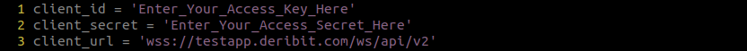

<a name="index"/>

#### 3. Index Price
  
```shell
index(currency)
```
 
 | Paramaters          | Type       | Description                                         |
 |---------------------|------------|-----------------------------------------------------|
 | `currency  `        | `string`   | 'BTC', 'ETH'                                        |

https://docs.deribit.com/v2/#public-get_index

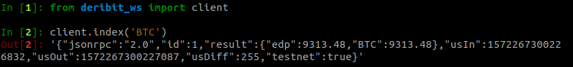

<a name="ticker"/>

#### 4. Ticker Data
  
`ticker(instrument_name)`

 | Paramaters          | Type       | Description                                          |                                         
 |---------------------|------------|------------------------------------------------------|
 | `instrument_name  ` | `string`   | 'BTC-PERPETUAL', 'ETH-PERPETUAL'                     |

https://docs.deribit.com/v2/#public-ticker

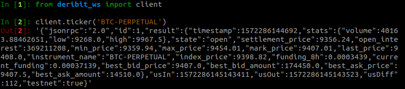

<a name="buy"/>

#### 5. Buy

`buy(instrument_name, amont, order_type, price, post_only)`

 | Paramaters          | Type       | Description                                         |
 |---------------------|------------|-----------------------------------------------------|
 | `instrument_name  ` | `string`   | 'BTC-PERPETUAL', 'ETH-PERPETUAL'                    |
 | `amount  `          | `int`      | number of contracts to purchase                     |
 | `order_type  `      | `string`   | 'market', 'limit'                                   |
 | `price       `      | `int`      | price to purchase contracts at                      |          
 | `post_only   `      | boolean    | True / False                                        |

https://docs.deribit.com/v2/#private-buy

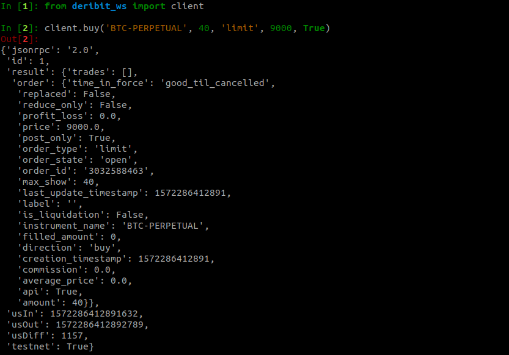

<a name="sell"/>

#### 6. Sell

`sell(instrument_name, amont, order_type, price, post_only)`

 | Paramaters          | Type       | Description                                         |
 |---------------------|------------|-----------------------------------------------------|
 | `instrument_name  ` | `string`   | 'BTC-PERPETUAL', 'ETH-PERPETUAL'                    |
 | `amount  `          | `int`      | number of contracts to purchase                     |
 | `order_type  `      | `string`   | 'market', 'limit'                                   |
 | `price       `      | `int`      | price to purchase contracts at                      |          
 | `post_only   `      | boolean    | True / False                                        |

https://docs.deribit.com/v2/#private-sell

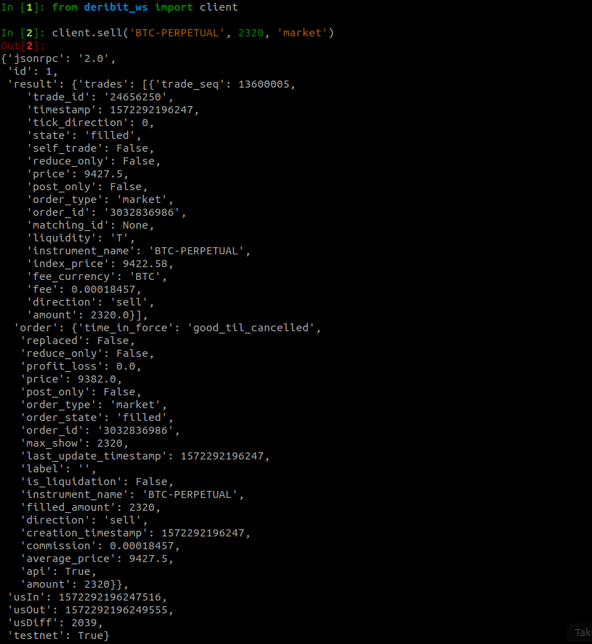


<a name="stop_buy"/>

#### 7. Stop Buy

`stop_buy(instrument_name, trigger, amont, order_type, stop_price, price)`

 | Paramaters          | Type       | Description                                         |
 |---------------------|------------|-----------------------------------------------------|
 | `instrument_name  ` | `string`   | 'BTC-PERPETUAL', 'ETH-PERPETUAL'                    |  
 | `trigger  `         | `string`   | 'index_price', 'mark_price', 'last_price'           |
 | `amount  `          | `int`      | number of contracts to purchase                     |
 | `order_type  `      | `string`   | 'stop_market', 'stop_limit'                         |
 | `stop_price       ` | `int`      | price at which order is triggered                   |          
 | `price   `          | `int`      | price to purchase contracts at                      | 

https://docs.deribit.com/v2/#private-buy

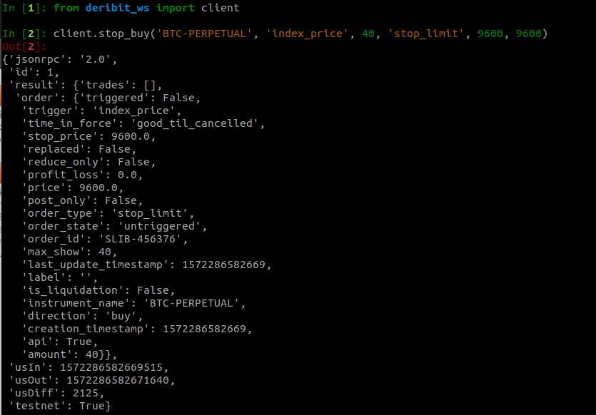

<a name="stop_sell"/>

#### 8. Stop Sell

`stop_sell(instrument_name, trigger, amont, order_type, stop_price, price)`

 | Paramaters          | Type       | Description                                         |
 |---------------------|------------|-----------------------------------------------------|
 | `instrument_name`   | `string`   | 'BTC-PERPETUAL', 'ETH-PERPETUAL'                    |  
 | `trigger`           | `string`   | 'index_price', 'mark_price', 'last_price'           |
 | `amount`            | `int`      | number of contracts to purchase                     |
 | `order_type`        | `string`   | 'stop_market', 'stop_limit'                         |
 | `stop_price`        | `int`      | price at which order is triggered                   |          
 | `price`             | `int`      | price to purchase contracts at                      | 
 
https://docs.deribit.com/v2/#private-sell

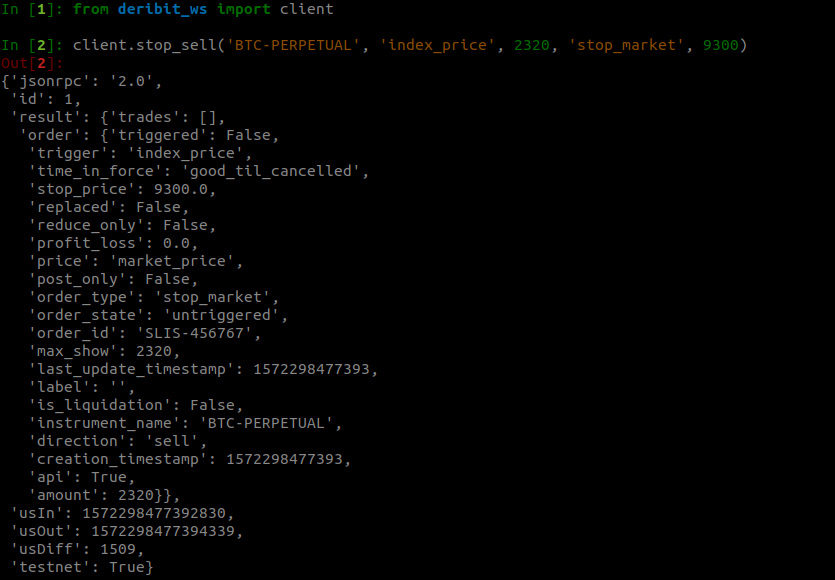

<a name="edit"/>

#### 8. Edit

`edit(order_id, amount, price)`

 | Paramaters          | Type       | Description                                         |
 |---------------------|------------|-----------------------------------------------------|
 | `order_id`          | `string`   | id of order '3032588463'                            |  
 | `amount`            | `int`      | edit number of contracts                            |
 | `price`             | `int`      | edit price of contracts                             |

https://docs.deribit.com/v2/#private-edit

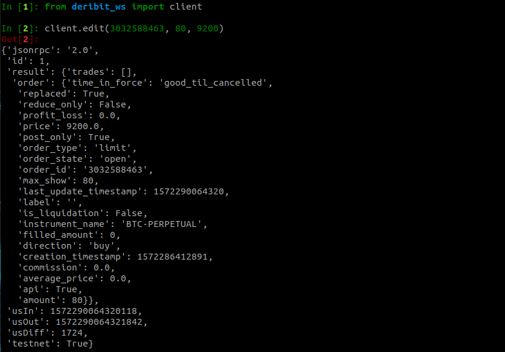

<a name="cancel"/>

#### 8. Cancel

`cancel(order_id)`

 | Paramaters          | Type       | Description                                         |
 |---------------------|------------|-----------------------------------------------------|
 | `order_id`          | `string`   | id of order to be canceled '3032588463'             |  

https://docs.deribit.com/v2/#private-cancel

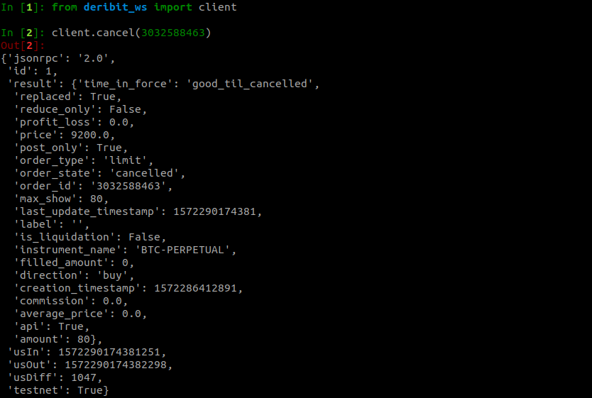

<a name="cancel_all"/>

#### 8. Cancel All

`cancel_all()`

_This method takes no parameters_

https://docs.deribit.com/v2/#private-cancel_all

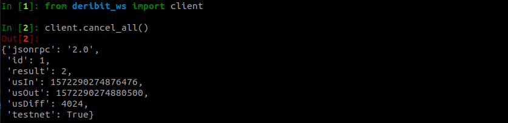

<a name="account_summary"/>

#### 8. Account Summary

`account_summary(currency)`

 | Paramaters          | Type       | Description                                         |
 |---------------------|------------|-----------------------------------------------------|
 | `currency`          | `string`   | 'BTC', 'ETH'                                        |
 
https://docs.deribit.com/v2/#private-get_account_summary

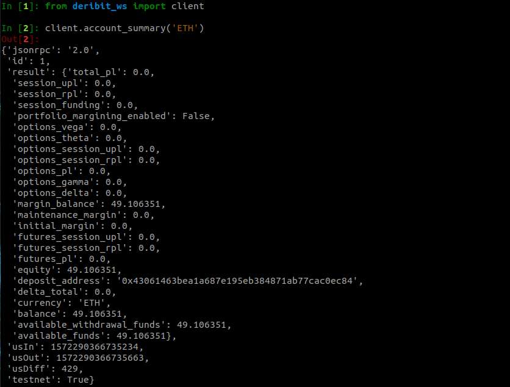

<a name="get_position"/>

#### 8. Get Position

`get_position(currency)`

 | Paramaters          | Type       | Description                                         |
 |---------------------|------------|-----------------------------------------------------|
 | `instrument_name`   | `string`   | 'BTC-PERPETUAL', 'ETH-PERPETUAL'                    |
 
https://docs.deribit.com/v2/#private-get_position

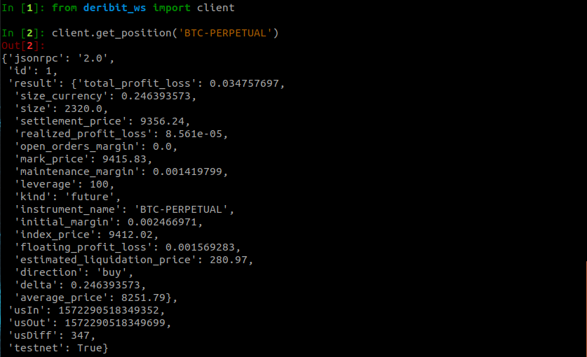
